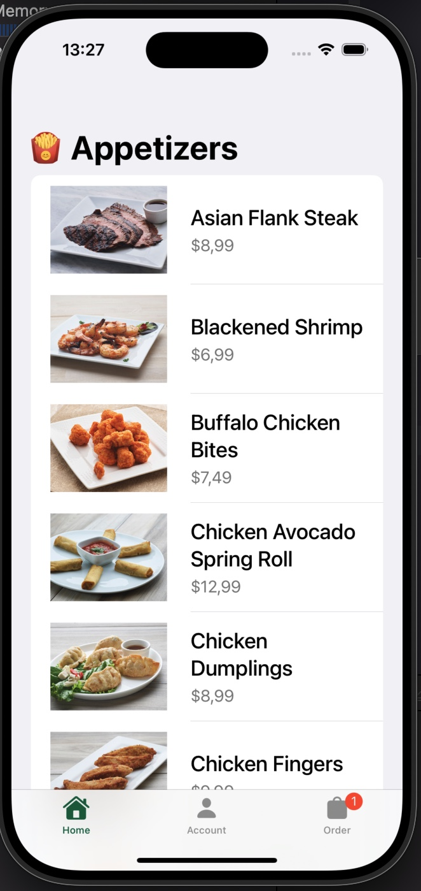
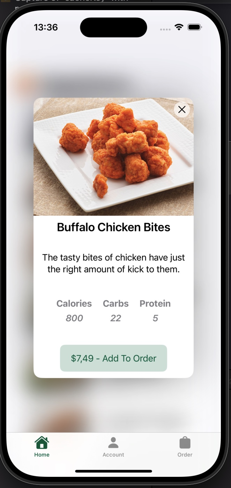
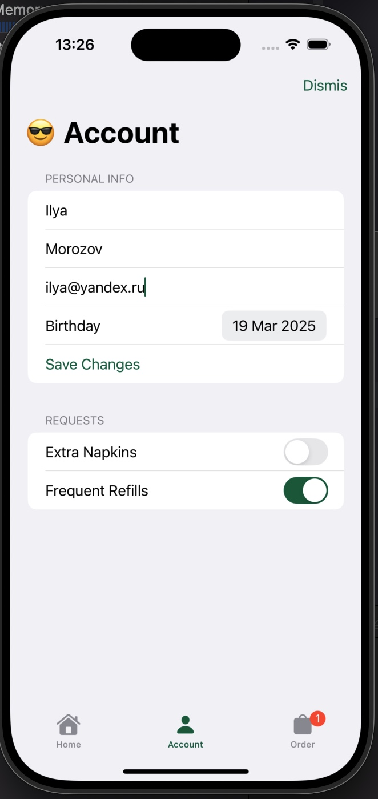
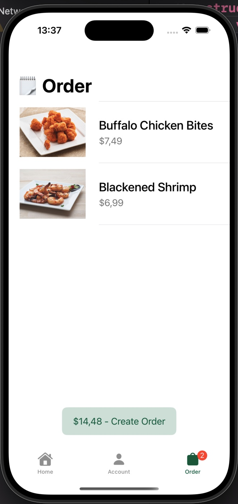
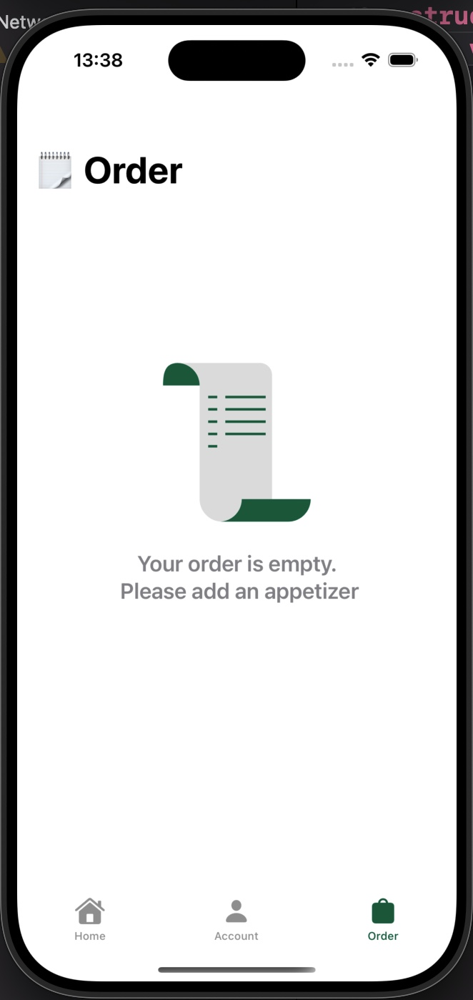

# MIFood

Проект написан по курсу Sean Allen (SwiftUI)

## Описание

Проект представляет собой магазин закусок. Магазин состоит из трех модулей - Главная, Профиль, Заказ (Корзина)

### Главная
Home Module состоит из двух эканов - Каталог и экран с блюдом
Каталог представляет из себя List со списком блюд
Экран с блюдом - описание блюда и возможность добавить его в заказ

### Профиль
Account Module - состоит из одного экрана с данными пользователя, есть функция сохранения данных в UserDefaults (через оболочку @AppStorage)

### Заказ
Order Module - состоит из одного экрана - который является корзиной, с выбранными закусками

## Технологический стек - SwiftUI, Swift Concurency, @AppStorage (UserDefaults)

## Архитектура - MVVM

## Скрины экранов

